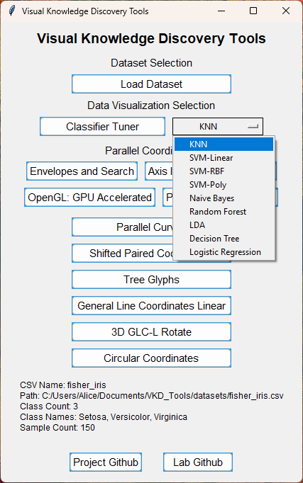
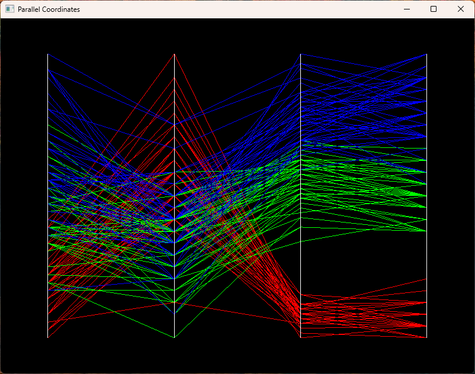
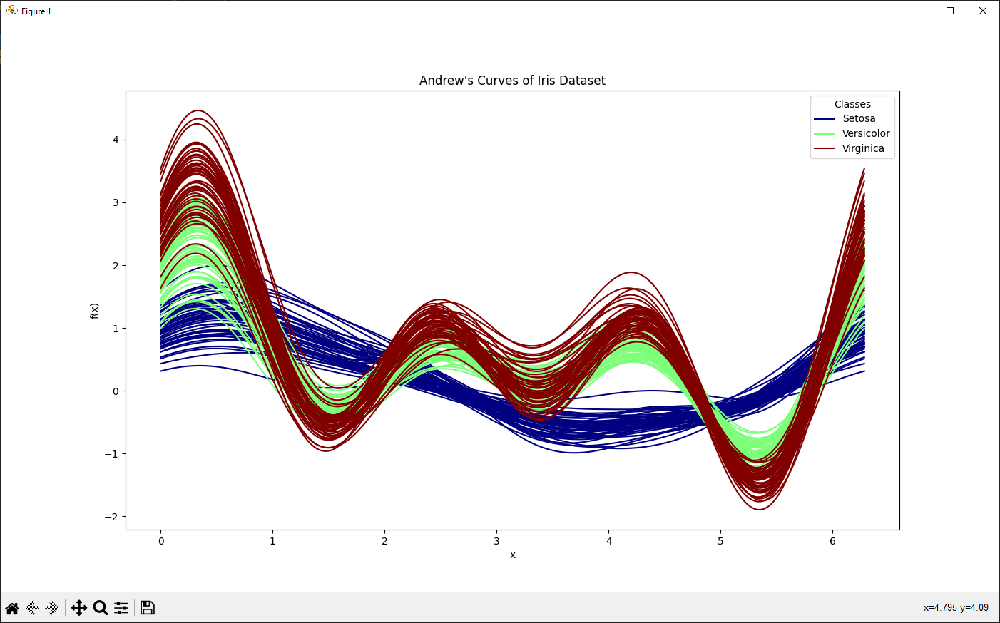
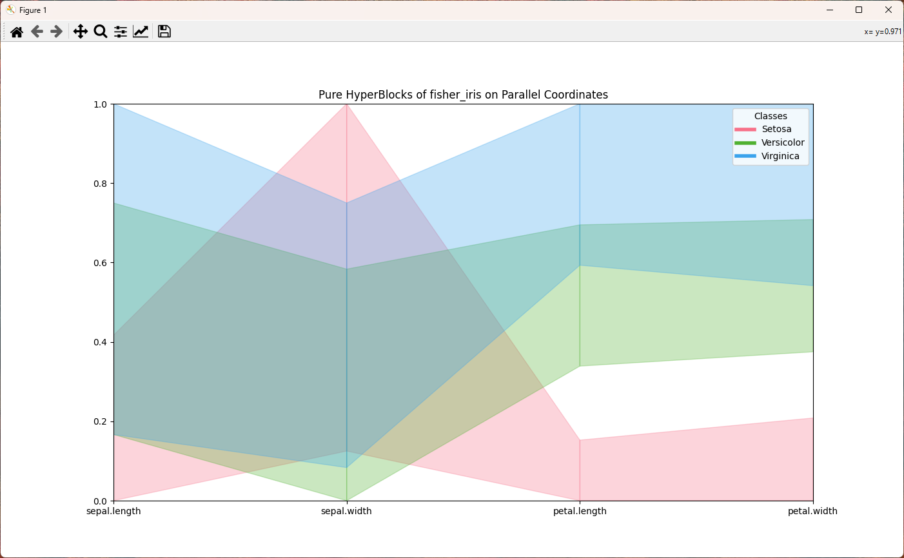
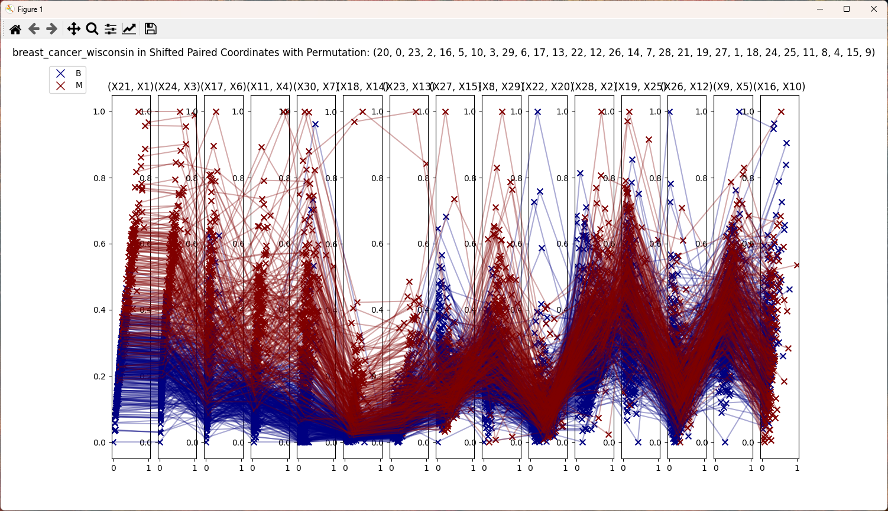

# VKD_Tools

## Overview

VKD_Tools are designed for the visual knowledge discovery of multidimensional classification data. These tools facilitate the visualization, exploration, and identification of complex n-D data patterns through lossless reversible visualizations.

To get started, launch the `menu.py` script and load a dataset. Datasets can be added to the datasets folder, adhering to the following requirements:
- A column with the header 'class' must be present for labeling purposes.
- Other columns are assumed to be feature columns.
- The top header row must label the 'class' and feature columns.

Select a visualization to explore from the descriptions provided below.

## Libraries

The following Python libraries are required to run the scripts:

To install: `python -m pip install -r requirements.txt`, the requirements.txt file contains all libraries and versions used for pip to install from.  

### Data Manipulation and Analysis

- pandas
- numpy
- scikit-learn

### Data Visualization

- matplotlib
- plotly
- PyOpenGL (optional: `pyopengl-accelerate`, `wheel`)

### User Interface and System Interaction

- tkinter
- argparse
- subprocess
- webbrowser

### Main Menu Script

- `menu.py`: Provides a Tkinter-based graphical user interface as the main menu for launching visualization scripts.

### Visualization Scripts

1. `classifier_tuner.py`: Tunes the hyperparameters of the selected classifier with a search through common options in 5-fold cross-validation.
   - Results are displayed as pair-wise scatterplots in an attribute pairing matrix (bottom-half).

   
   

2. `envelope_plotter.py`: Creates an interactive application for plotting envelope-like structures.
   - Utilizes PyQt6 for the graphical user interface.
   - Employs OpenGL for rendering.
   - Features drag and drop searchable hyper-rectangle with WASD resizing; right-click to clear.

   

3. `plotly_demo.py`: Utilizes Plotly for data visualization.
   - Presents data in draggable axis parallel coordinates plot.
   - Classes are distinctly displayed with a heatmap legend.

   

4. `parallel_gl.py`: Renders parallel coordinates in OpenGL using GPU pipelines.
   - Includes zoom functionality with the mouse wheel; panning is a work in progress.

   

5. Parallel Andrew's Curves using matplotlib.

   

6. `parallel_hb.py`: Focuses on the visualization of pure hyper-blocks.

   

7. `shifted_paired.py`: Generates a sequence of shifted paired coordinates subplots.
   - Plots all attributes of feature vectors as normalized paired axes.
   - Connects feature vector samples with a line across subplots.
   - Duplicates the last attribute when the feature vector length is odd.
   - Allows scrolling through permutations of the feature vector with the mouse wheel.
   - Displays a Linear Discriminant Analysis (LDA) resultant coefficient-determined permutation first.

   

8. `tree_glyph_plotter.py`: Generates high-dimensional data visualizations using tree-like glyphs.
   - Offers lossless visualization of high-dimensional data.
   - Plots a permutation of the feature vector in tree glyphs.
   - Permits cycling through plotted permutations with the mouse wheel.
   - Prioritizes displaying an LDA resultant coefficient-determined permutation first.

   

9. `glc_line_plotter.py`: Produces GLC linear plots.
   - Displays the first class in the top subplot, with other classes below.
   - Projects the last glyph per class onto the x-axis.
   - Processes data with LDA and sorts by the coefficient array.
   - Plots the LDA boundary with a yellow dotted line on the x and y axes.
   - Utilizes the GLC-AL algorithm for a 100-epoch search to maximize accuracy of coefficients.

   

10. 3D GLC-L Rotation.
    - Introduces an additional z-axis using the tan function for GLC-L.
    - Features an SVM-determined boundary border.

    

11. `circular_plotter.py`: Generates circular plots using Matplotlib and scikit-learn.
    - Processes data with LDA and plots the discriminant line.
    - Displays a classification confusion matrix.
    - Manages data preprocessing with Pandas and NumPy.
    - Includes a draggable LDA discriminant line.

    

---

### Acknowledgements

- CWU Visual Knowledge Discovery and Imaging Lab at <https://github.com/CWU-VKD-LAB>

