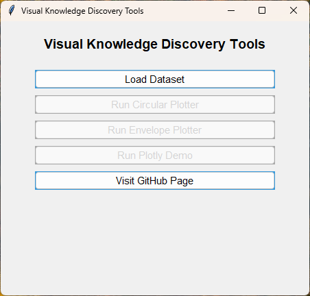
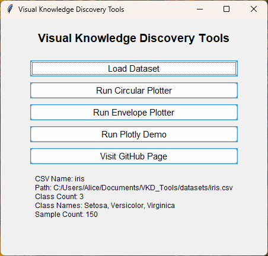
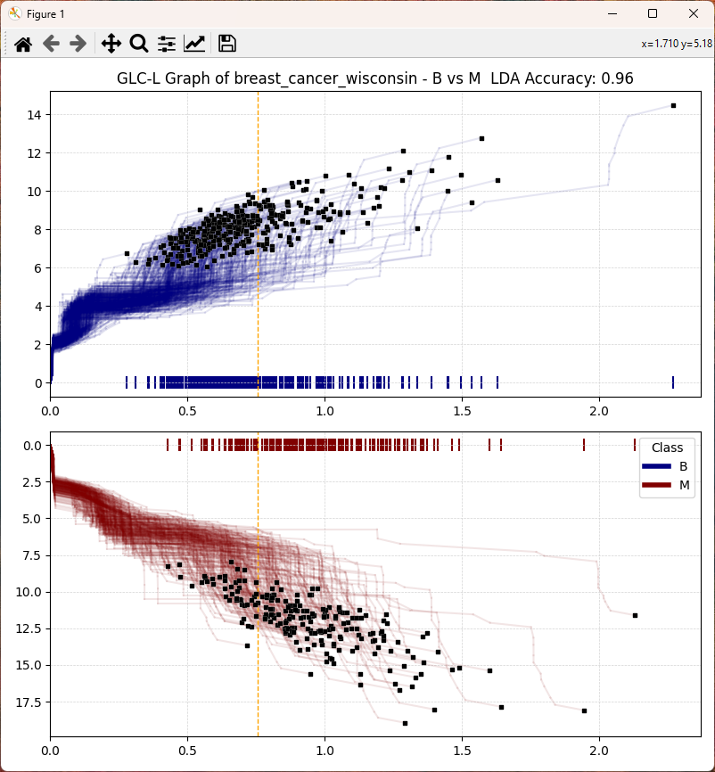
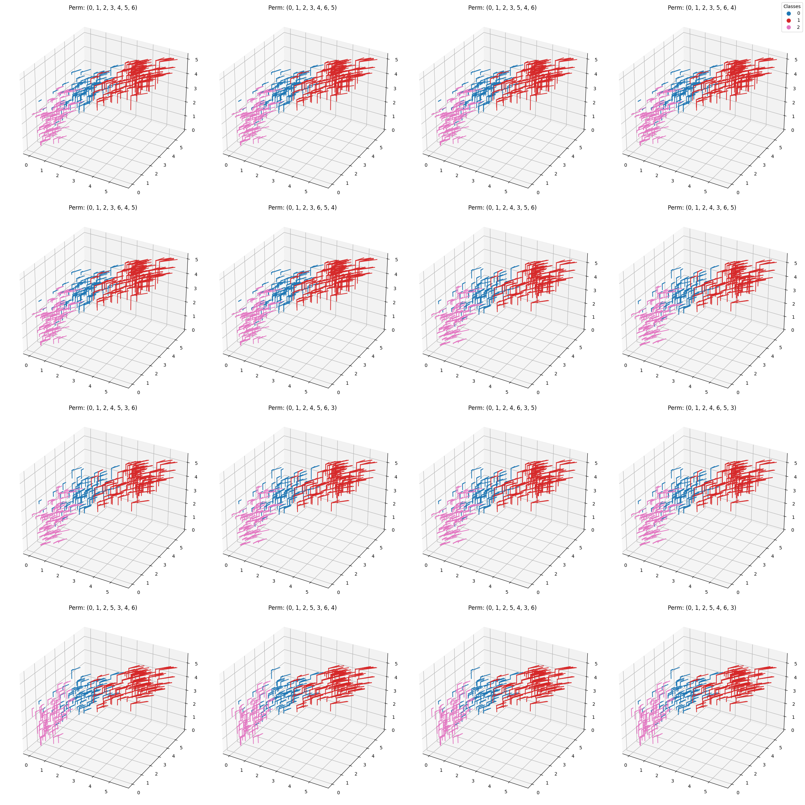

# VKD_Tools

Tools made for visual knowledge discovery of multidimensional classification data

## Overview

These scripts are designed for visualizing multi-dimensional data. All of them allow the user to select files for data input.

## Libraries

These python libraries are required to run these scripts.

### Data Manipulation and Analysis

- pandas
- numpy
- scikit-learn

### Data Visualization

- matplotlib
- plotly
- PyOpenGL

### User Interface and System Interaction

- tkinter
- argparse
- subprocess
- webbrowser

### Main Menu Script

- menu.py: Provides a Tkinter-based graphical user interface as a main menu for launching the visualization scripts.

### Visualization Scripts

1. envelope_plotter.py: Creates an interactive application for plotting envelope-like structures.
    - Utilizes PyQt6 for the graphical user interface.
    - Employs OpenGL for rendering graphical elements.  

    

2. circular_plotter.py: Produces circular plots using Matplotlib and scikit-learn.
    - Incorporates machine learning techniques like Linear Discriminant Analysis.
    - Handles data preprocessing using Pandas and NumPy.  

    

3. plotly_demo.py: Focuses on data visualization using Plotly.
    - Reads the selected data file using Pandas.
    - Creates visualizations with Plotly based on the imported data.  

    

4. glc_line_plotter.py: Generates GLC line glyphs.
    - Generates a multidimensional GLC line graph.
    - Projects last glyph per class to x axis.
    - Processes data with Linear Discriminant Analysis and sorts by coefficient array.

    

5. tree_glyph_plotter.py: Generates high-dimensional data visualization using tree-like glyphs.
    - Lossless visualization of high-dimensional data.
    - Plots a permutation subplot matrix and saves to png output files.

    

---

### Aknowledgements

- CWU Visual Knowledge Discovery and Imaging Lab at <https://github.com/CWU-VKD-LAB>
